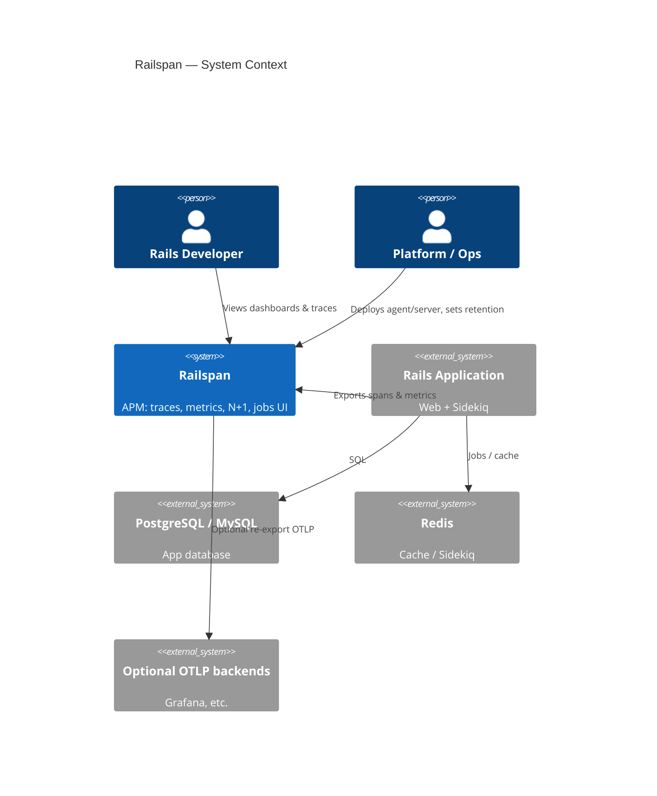
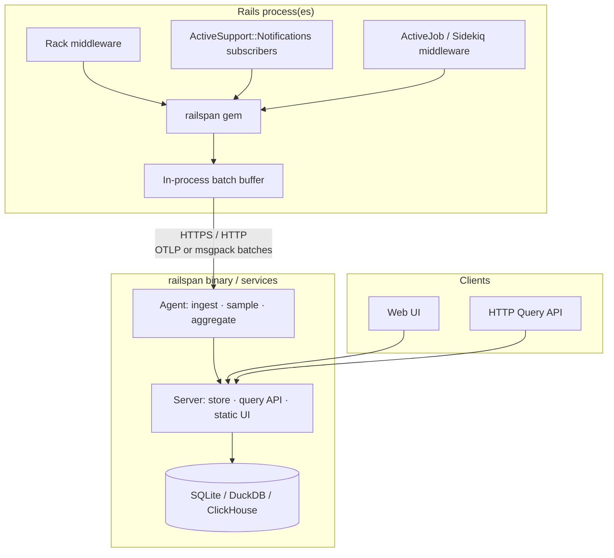
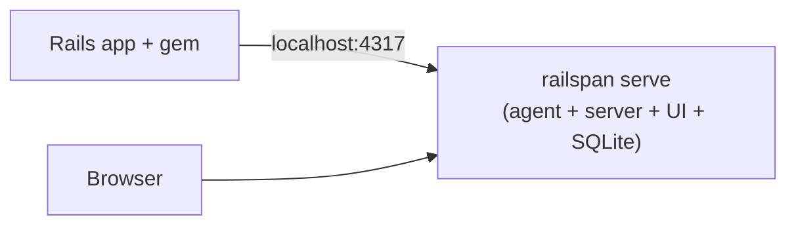
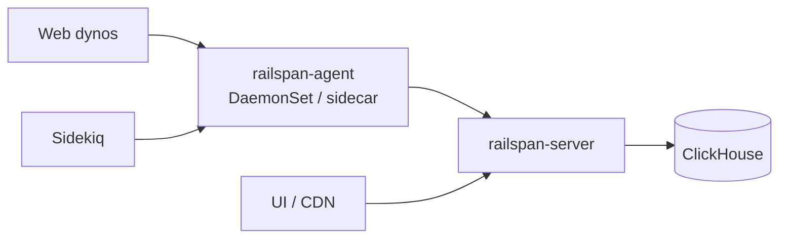
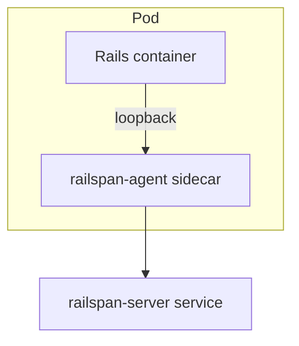
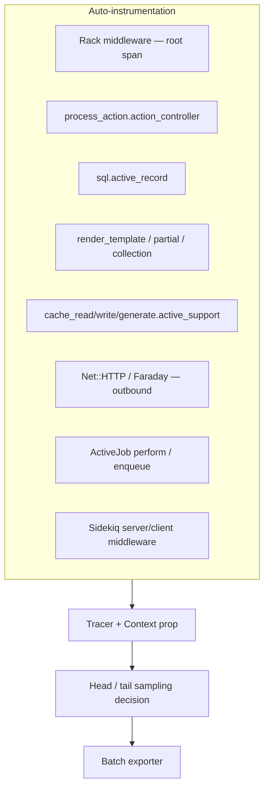
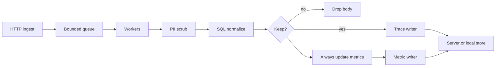
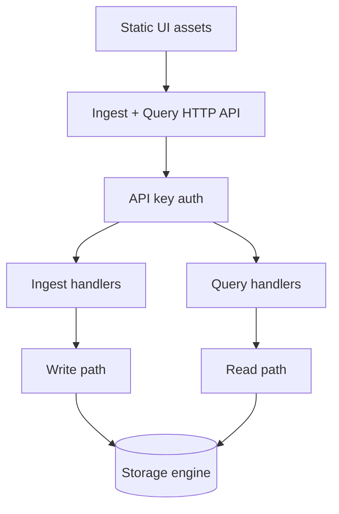
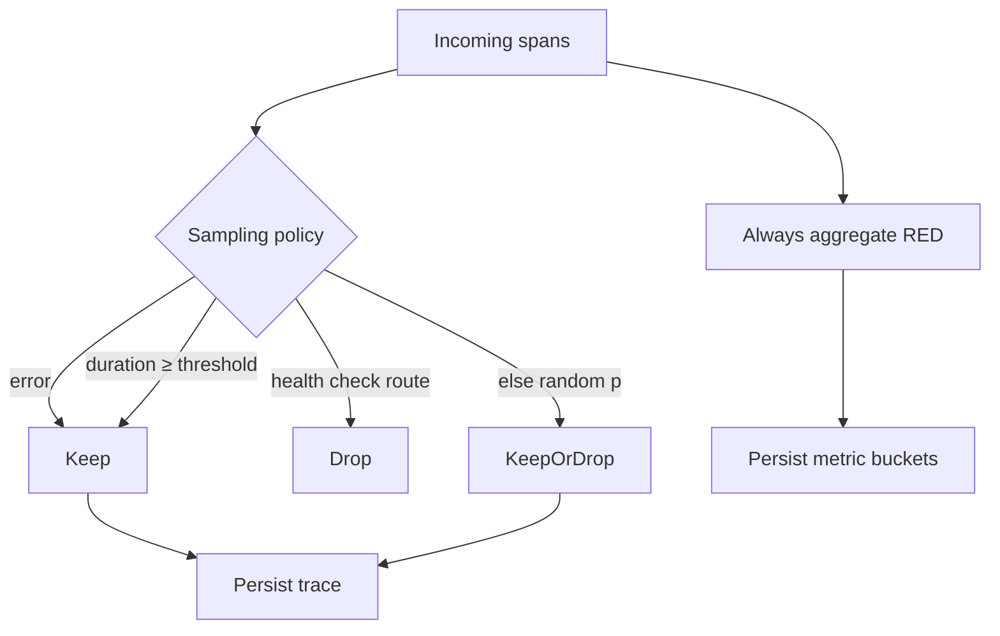
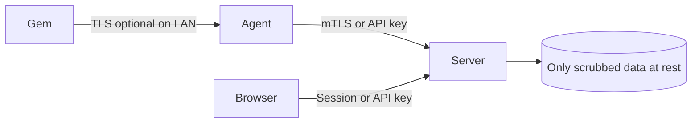

# Architecture

## System context



*(If Mermaid C4 is unavailable in your viewer, use the component diagram below.)*

## Component overview



## Deployment topologies

### 1. Local / small app (default MVP)



Single process (or docker one-container) for dogfooding and small production.

### 2. Production split (scale path)



### 3. Agent as sidecar (Kubernetes)



## Request lifecycle (happy path)

```mermaid
sequenceDiagram
  participant U as User
  participant R as Rails + gem
  participant A as Agent (Rust)
  participant S as Server (Rust)
  participant DB as Store
  participant UI as UI

  U->>R: HTTP GET /users/1
  activate R
  R->>R: Start root span (Rack)
  R->>R: Controller span
  R->>R: SQL spans (AR)
  R->>R: Render spans
  R->>R: End root span; enqueue to buffer
  R-->>U: 200 OK
  deactivate R

  R->>A: Batch POST /v1/traces (periodic flush)
  A->>A: Scrub · normalize SQL · sample
  A->>A: Update RED histograms
  A->>S: Forward kept traces + metric rollups
  S->>DB: Insert spans / upsert metrics

  UI->>S: GET /api/endpoints?range=24h
  S->>DB: Aggregate query
  S-->>UI: Endpoint list p50/p95/p99
  UI->>S: GET /api/traces/:id
  S-->>UI: Waterfall spans
```

## Instrumentation points (Ruby gem)



### Span hierarchy example

```text
[rack.request] GET /users/1                    120ms
├── [controller] UsersController#show           118ms
│   ├── [sql] SELECT users WHERE id = ?          3ms
│   ├── [sql] SELECT posts WHERE user_id = ? ×47  95ms  ← N+1
│   └── [view] users/show.html.erb              15ms
│       └── [partial] posts/_post ×47           12ms
└── [http.client] GET https://api.example/...    0ms (none)
```

## Agent internals



### Agent responsibilities

| Responsibility | Notes |
|----------------|-------|
| Receive batches | OTLP/HTTP and/or native msgpack |
| Backpressure | Drop or sample harder when queue full; never block Rails long |
| SQL normalization | Strip literals → `?` for cardinality control |
| PII rules | Emails, tokens, password params |
| Sampling | Errors + slow always; probabilistic otherwise |
| Aggregation | Histograms / T-digest or HDR for latency |
| Health | `/healthz`, metrics about drop rate |

## Server internals



### Storage strategy

| Stage | Engine | Use |
|-------|--------|-----|
| MVP | SQLite | Single node, simple ops |
| Growth | DuckDB or SQLite + files | Better analytics locally |
| Scale | ClickHouse | Multi-tenant / high cardinality time series |

**Retention defaults (proposed)**

- Raw traces: 7 days  
- Metrics rollups: 90 days  
- Configurable via CLI/env  

## Data flow: sampling & metrics



**Invariant:** Dropping a trace never drops its contribution to endpoint metrics.

## Security model



| Concern | Approach |
|---------|----------|
| AuthN ingest | Project API key in `Authorization: Bearer` |
| AuthN UI | Single-user token or basic auth for MVP; OIDC later |
| PII | Default scrubbers; allowlist attributes |
| Multi-tenant isolation | `project_id` on all rows; no cross-project queries |

## Technology choices (decisions)

| Area | Choice | Rationale |
|------|--------|-----------|
| Agent/server language | Rust | Memory safety, low RSS, concurrency |
| Async runtime | Tokio | Ecosystem standard |
| HTTP | Axum | Ergonomic, typed |
| Ruby bindings to agent | None in-process for MVP | HTTP export keeps GVL/crash isolation |
| Optional later | magnus extension | Only if export encoding is hot |
| Wire format | OTLP/HTTP + compact native | Interop + efficiency |
| UI | Vite + React or Svelte | Fast iteration; swap later if needed |
| Local packaging | `railspan` CLI binary embeds UI | One-command DX |

## Failure modes

| Failure | Behavior |
|---------|----------|
| Agent down | Gem buffers then drops with counter; app must not crash |
| Server down | Agent local spool (optional) or drop with metrics |
| Store full | Reject ingest 507; alert via agent health metric |
| Clock skew | Prefer client span durations; server stores received_at too |
| Huge SQL text | Truncate to N KB after normalize |

## Observability of Railspan itself

Dogfood: agent/server expose Prometheus-style `/metrics` (or self-ingest):

- spans_received, spans_dropped, queue_depth  
- flush_latency, write_latency  
- gem_export_errors (from app logs / agent)

## Open architecture decisions (ADR later)

1. SQLite vs DuckDB for MVP analytics  
2. Pure OTLP vs dual native protocol  
3. Single binary vs agent/server split packages  
4. UI framework  
5. License  
