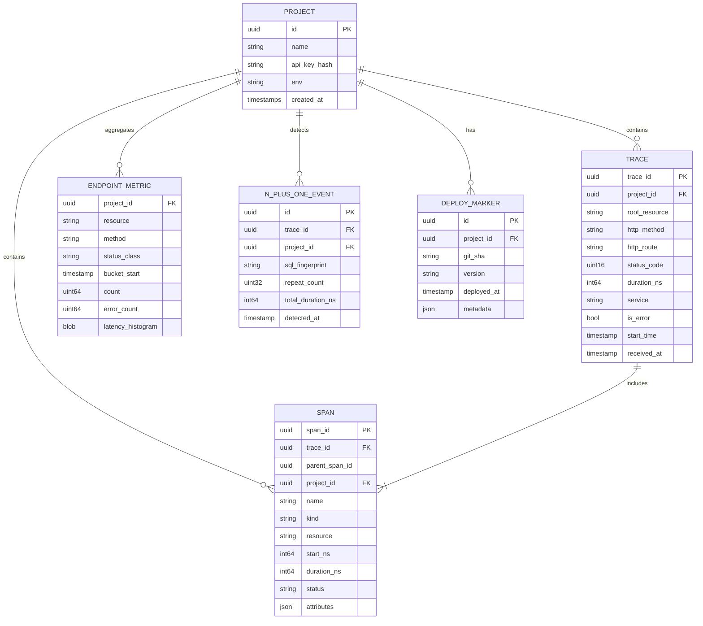

# Data Model

## Design goals

- Cheap writes at ingest
- Fast “top endpoints” and “trace waterfall” reads
- Controlled cardinality (never store raw unique SQL with literals as a metric key)
- Multi-project from day one (`project_id`)

## Logical entities



## Span kinds (controlled vocabulary)

| kind | Source | Example resource |
|------|--------|------------------|
| `http.server` | Rack | `GET /users/:id` |
| `controller` | Action Controller | `UsersController#show` |
| `sql` | ActiveRecord | `SELECT users WHERE id = ?` |
| `view` | Action View | `users/show` |
| `partial` | Action View | `posts/post` |
| `cache` | ActiveSupport::Cache | `read users:1` |
| `http.client` | Net::HTTP / Faraday | `GET api.stripe.com` |
| `job` | ActiveJob / Sidekiq | `SendWelcomeEmail` |
| `custom` | Manual API | user-defined |

## Core attributes (span.attributes)

### Common

| Key | Type | Notes |
|-----|------|-------|
| `service.name` | string | `web`, `sidekiq` |
| `deployment.environment` | string | `production` |
| `code.namespace` | string | optional |
| `error` | bool | |
| `error.type` | string | exception class |
| `error.message` | string | scrubbed/truncated |

### HTTP server

| Key | Type |
|-----|------|
| `http.method` | string |
| `http.route` | string (normalized) |
| `http.status_code` | int |
| `url.path` | string (may scrub) |
| `user_agent.original` | string (optional, often drop) |

### SQL

| Key | Type | Notes |
|-----|------|-------|
| `db.system` | string | `postgresql`, `mysql` |
| `db.statement` | string | **normalized** fingerprint |
| `db.statement_raw` | string | optional, sampled, scrubbed, truncated |
| `db.rows` | int | if available |
| `db.connection` | string | `primary`, `replica` |

### Job

| Key | Type |
|-----|------|
| `messaging.system` | `sidekiq` / `active_job` |
| `messaging.destination` | queue name |
| `job.class` | string |
| `job.attempts` | int |
| `job.provider_job_id` | string |

## SQL normalization rules

Input:

```sql
SELECT * FROM users WHERE id = 42 AND email = 'a@b.com'
```

Fingerprint:

```sql
SELECT * FROM users WHERE id = ? AND email = ?
```

Rules:

1. Replace string/number/time literals with `?`
2. Collapse `IN (1,2,3)` → `IN (?)`
3. Truncate length &gt; 2_000 chars
4. Never use raw SQL as metric dimension — only fingerprint
5. Optional: parse with `pg_query`-style later for better fingerprints

## Metric model (RED)

For each time bucket (default 60s) and dimensions:

```text
project_id, env, service, resource, method, status_class
```

Store:

- `count`
- `error_count`
- latency histogram (HDR histogram or exponential buckets)

Derived at query time: rate, error rate, p50/p95/p99.

## N+1 detection model

Within a single trace, group `sql` spans by fingerprint.

```text
IF count(fingerprint) >= threshold (default 5)
AND same parent controller/view region
THEN emit N_PLUS_ONE_EVENT
AND flag trace / endpoint summary
```

Store enough to show UI:

- fingerprint  
- count  
- total time  
- example trace_id  

## Identity & IDs

| ID | Format | Notes |
|----|--------|-------|
| `trace_id` | 16 bytes hex (OTLP-compatible) | Generated in gem |
| `span_id` | 8 bytes hex | Generated in gem |
| `project_id` | UUID | Server-assigned |
| Deploy | UUID | Server or API-created |

## SQLite physical sketch (MVP)

```sql
-- illustrative; migrations owned by server crate

CREATE TABLE projects (
  id TEXT PRIMARY KEY,
  name TEXT NOT NULL,
  api_key_hash TEXT NOT NULL UNIQUE,
  created_at INTEGER NOT NULL
);

CREATE TABLE traces (
  trace_id TEXT PRIMARY KEY,
  project_id TEXT NOT NULL,
  root_resource TEXT,
  http_method TEXT,
  http_route TEXT,
  status_code INTEGER,
  duration_ns INTEGER NOT NULL,
  service TEXT,
  is_error INTEGER NOT NULL DEFAULT 0,
  start_time_ns INTEGER NOT NULL,
  received_at_ns INTEGER NOT NULL
);
CREATE INDEX idx_traces_project_time ON traces(project_id, start_time_ns DESC);
CREATE INDEX idx_traces_project_resource ON traces(project_id, root_resource, start_time_ns DESC);

CREATE TABLE spans (
  span_id TEXT PRIMARY KEY,
  trace_id TEXT NOT NULL,
  parent_span_id TEXT,
  project_id TEXT NOT NULL,
  name TEXT NOT NULL,
  kind TEXT NOT NULL,
  resource TEXT,
  start_ns INTEGER NOT NULL,
  duration_ns INTEGER NOT NULL,
  status TEXT,
  attributes_json TEXT
);
CREATE INDEX idx_spans_trace ON spans(trace_id);

CREATE TABLE endpoint_metrics (
  project_id TEXT NOT NULL,
  resource TEXT NOT NULL,
  method TEXT NOT NULL,
  status_class TEXT NOT NULL,
  bucket_start_ns INTEGER NOT NULL,
  count INTEGER NOT NULL,
  error_count INTEGER NOT NULL,
  histogram_blob BLOB NOT NULL,
  PRIMARY KEY (project_id, resource, method, status_class, bucket_start_ns)
);

CREATE TABLE n_plus_one_events (
  id TEXT PRIMARY KEY,
  project_id TEXT NOT NULL,
  trace_id TEXT NOT NULL,
  sql_fingerprint TEXT NOT NULL,
  repeat_count INTEGER NOT NULL,
  total_duration_ns INTEGER NOT NULL,
  detected_at_ns INTEGER NOT NULL
);

CREATE TABLE deploy_markers (
  id TEXT PRIMARY KEY,
  project_id TEXT NOT NULL,
  git_sha TEXT,
  version TEXT,
  deployed_at_ns INTEGER NOT NULL,
  metadata_json TEXT
);
```

## Cardinality guardrails

| Dimension | Allowed |
|-----------|---------|
| `http.route` | Normalized routes only (`/users/:id`) |
| Raw path with IDs | No (metric dim) |
| SQL fingerprint | Yes |
| Raw SQL with literals | No (metric dim); optional on span sample |
| User id | No by default |
| Job class | Yes |
| Job id | Trace attr only |

## Query patterns (must be fast)

1. Top endpoints by p95 in range  
2. Trace list filtered by resource + min duration  
3. Spans for one `trace_id` ordered by start  
4. N+1 events in range  
5. Latency around deploy markers  

Index and bucket design should serve these five first.
