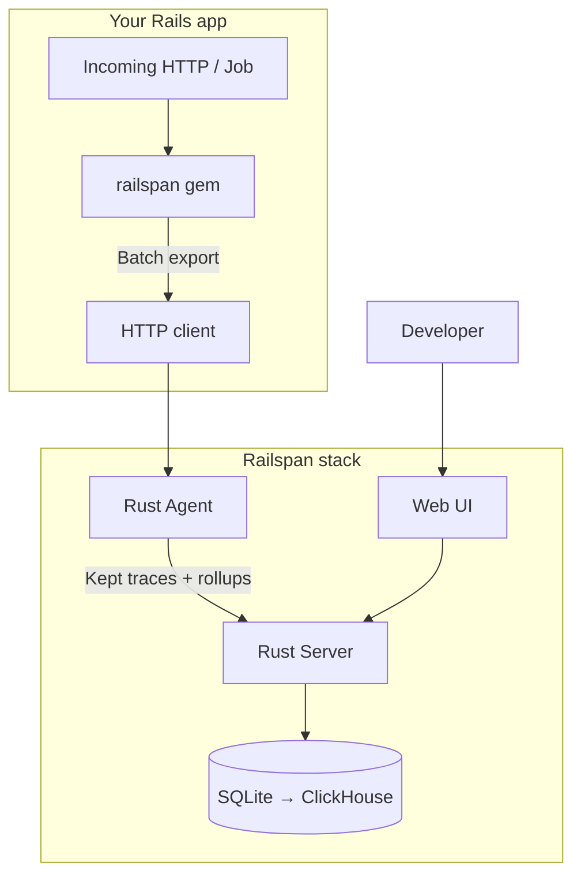
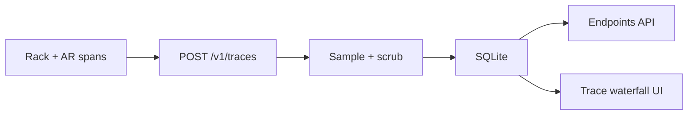
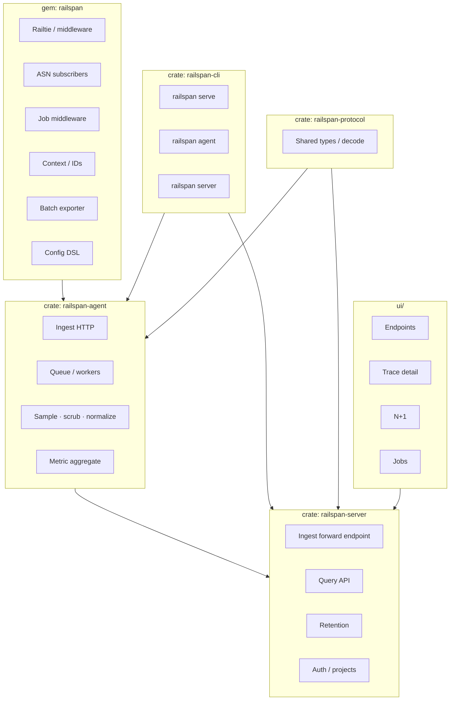
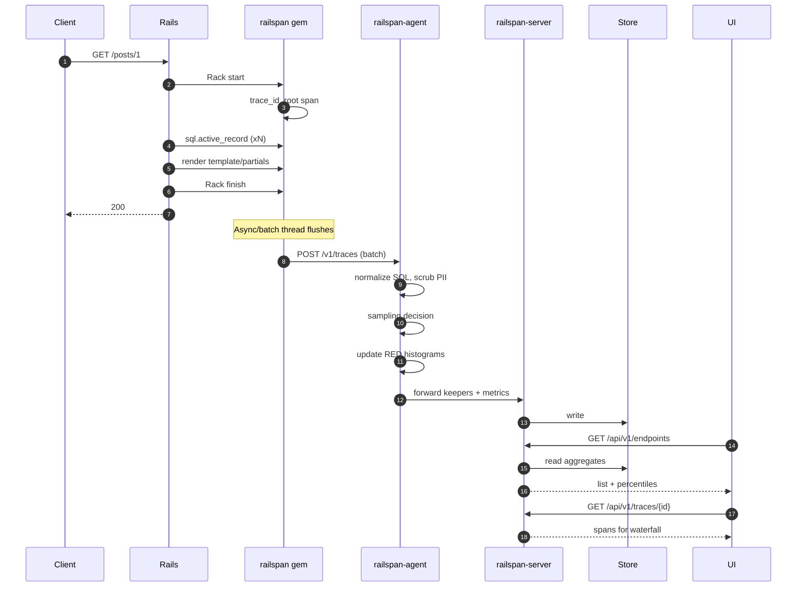
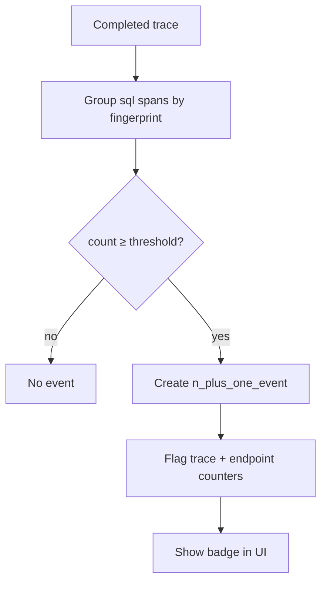

# Railspan — Master Plan

**Working title:** Railspan  
**One-liner:** Lightweight, self-hosted, Rails-first APM (traces, RED metrics, N+1, jobs).  
**Status:** Planning complete — ready for epics/stories and implementation.  
**Root:** `/Users/said.kaldybaev/projects/railspan`

---

## 1. Executive summary

Build an open-source performance product for Ruby on Rails that answers:

1. Which endpoints are slow?  
2. Why (SQL, views, HTTP, cache)?  
3. Where are N+1s?  
4. Are background jobs healthy?  
5. Did a deploy make things worse?

Architecture mirrors Datadog’s shape (**SDK → agent → backend → UI**) but **only** the Rails APM vertical. The agent and server are **Rust** for low overhead; instrumentation is a **Ruby gem**.

| Doc | Purpose |
|-----|---------|
| [PRODUCT.md](./PRODUCT.md) | Problem, personas, scope, non-goals |
| [ARCHITECTURE.md](./ARCHITECTURE.md) | Components, sequences, deployments |
| [DATA_MODEL.md](./DATA_MODEL.md) | Entities, SQL sketch, cardinality |
| [PROTOCOL.md](./PROTOCOL.md) | Wire format, APIs, flush behavior |
| [ROADMAP.md](./ROADMAP.md) | Phases and exit criteria |
| [BACKLOG.md](./BACKLOG.md) | Epics + child stories for Jira |

---

## 2. Goals & non-goals

### Goals

| ID | Goal |
|----|------|
| G1 | Self-hosted APM installable in ≤ 15 minutes |
| G2 | Correct nested traces for Rails request lifecycle |
| G3 | Endpoint RED metrics with p50/p95/p99 |
| G4 | Trace waterfall UI |
| G5 | First-class N+1 detection |
| G6 | Sidekiq / ActiveJob visibility |
| G7 | Instrumented-app overhead budget &lt; ~2% |
| G8 | PII scrubbing defaults on |
| G9 | Path to OTLP without rewriting core |

### Non-goals (v1)

- Full Datadog (logs, RUM, security, infra)
- Multi-language APM
- Managed cloud (optional later)
- Replacing application logging stacks

---

## 3. End-to-end flow (north-star diagram)



### Vertical slice (first shippable product)



If this slice is delightful, expand to jobs/N+1/packaging.

---

## 4. Component responsibilities



---

## 5. Detailed request & export flow



---

## 6. N+1 detection flow



Default threshold: **5** identical fingerprints per trace (configurable).

---

## 7. Sampling policy (v1)

| Condition | Action |
|-----------|--------|
| `status = error` | Always keep full trace |
| Root duration ≥ slow threshold (config, e.g. 500ms or dynamic p95) | Keep |
| Route in deny list (`/up`, `/health`, `/assets/*`) | Drop spans; still optional minimal metrics |
| Else | Keep with probability `sample_rate` (default 0.05–0.1) |

**Invariant:** Metrics updated for **all** finished roots (or a consistent metric sample path documented separately). Prefer always-on metrics for roots.

---

## 8. Repository structure (target)

```text
/Users/said.kaldybaev/projects/railspan/
├── README.md
├── docs/
│   ├── PLAN.md              ← this file
│   ├── PRODUCT.md
│   ├── ARCHITECTURE.md
│   ├── DATA_MODEL.md
│   ├── PROTOCOL.md
│   ├── ROADMAP.md
│   ├── BACKLOG.md
│   ├── diagrams/            ← export PNGs later if needed
│   └── adrs/                ← architecture decision records
├── Cargo.toml               # workspace
├── crates/
│   ├── railspan-cli/
│   ├── railspan-agent/
│   ├── railspan-server/
│   └── railspan-protocol/
├── gem/
│   └── railspan/
├── ui/
├── docker/
├── examples/
│   └── dummy_rails/
└── scripts/
    └── bench_overhead.sh
```

---

## 9. Configuration sketch

### Gem (`config/initializers/railspan.rb`)

```ruby
Railspan.configure do |c|
  c.service_name = "my-app"
  c.environment  = Rails.env
  c.endpoint     = ENV.fetch("RAILSPAN_ENDPOINT", "http://127.0.0.1:7421")
  c.api_key      = ENV["RAILSPAN_API_KEY"]
  c.sample_rate  = 0.1
  c.slow_ms      = 500
  c.enabled      = true
  c.scrub_keys  += %w[ssn credit_card]
end
```

### Agent / server (env)

```bash
RAILSPAN_DATA_DIR=./data
RAILSPAN_HTTP_INGEST=7421
RAILSPAN_HTTP_UI=7422
RAILSPAN_RETENTION_TRACES=7d
RAILSPAN_RETENTION_METRICS=90d
```

---

## 10. Quality bar

### Performance

- Benchmark suite on `examples/dummy_rails`
- Compare p50/p99 with gem off vs on
- Agent RSS under sustained synthetic load

### Reliability

- Gem never raises into the request path (`fail_open`)
- Bounded memory in gem buffer and agent queue
- Graceful degrade when agent unavailable

### Security

- API keys hashed at rest
- Default scrubbers
- No raw secrets in span attributes

### UX

- Empty states with install instructions
- Waterfall readable without training
- N+1 obvious (badge + count + fingerprint)

---

## 11. Risks & mitigations

| Risk | Impact | Mitigation |
|------|--------|------------|
| Overhead too high | Uninstall | Sampling; cheap hooks; CI budgets |
| Cardinality explosion | DB death | SQL normalize; route normalize |
| Scope creep to “Datadog” | Never ship | Written non-goals; P0 vertical slice |
| OTel world moves on | Isolation | OTLP path in Phase 7; native stays simple |
| UI time sink | Late demo | API-first; minimal table+waterfall UI |
| MRI threading/fibers | Lost context | Explicit tests for async jobs & fibers |
| Storage growth | Disk full | Retention worker; defaults |

---

## 12. Suggested tech stack (locked for MVP unless ADR)

| Layer | Tech |
|-------|------|
| Rust HTTP | Tokio + Axum |
| Serialization | serde + rmp-serde (msgpack) + serde_json |
| DB MVP | SQLite via `sqlx` |
| CLI | clap |
| Ruby gem | Railtie, pure Ruby exporter |
| Test Rails | Rails 7.2+ / 8.x dummy app |
| UI | Vite + React or Svelte (decide in Phase 3 ADR) |
| CI | GitHub Actions |

---

## 13. Milestones → epics map

| Milestone | Epic IDs (see BACKLOG) |
|-----------|-------------------------|
| Scaffold | E0 |
| Instrumentation | E1 |
| Agent | E2 |
| Server + UI slice | E3 |
| Rails depth | E4 |
| Hardening | E5 |
| Packaging | E6 |
| Scale / OTLP | E7 |

---

## 14. Working agreements (for later implementation)

1. Every user-facing behavior starts as a story with acceptance criteria.  
2. Architecture changes that affect boundaries get an ADR under `docs/adrs/`.  
3. Prefer vertical slices over horizontal “finish all Ruby then all Rust.”  
4. Dogfood on dummy app every phase.  
5. Do not publish gem publicly until Phase 5 soak is done (private package OK).  

---

## 15. Immediate next actions

1. Review this plan + sibling docs; mark open questions.  
2. Create Jira (or linear) **epics and stories** from [BACKLOG.md](./BACKLOG.md).  
3. Phase 0: scaffold monorepo.  
4. Implement vertical slice (E1 partial + E2 partial + E3) before polishing.  

### Open questions to resolve early

| # | Question | Default proposal |
|---|----------|------------------|
| Q1 | Project name final? | **Railspan** |
| Q2 | License? | MIT |
| Q3 | UI framework? | Svelte or React — pick in E3 |
| Q4 | SQLite only until when? | Until single-node limits hurt |
| Q5 | Sidekiq Pro / Ent features? | Support open Sidekiq first |
| Q6 | JRuby / TruffleRuby? | MRI only for v1 |
| Q7 | Min Rails / Ruby versions? | Ruby 3.2+, Rails 7.1+ |

---

## 16. Appendix — glossary

| Term | Meaning |
|------|---------|
| RED | Rate, Errors, Duration |
| Fingerprint | Normalized SQL or route key |
| Root span | Outermost span for request/job |
| Fail-open | Prefer losing telemetry over breaking app |
| OTLP | OpenTelemetry Protocol |
| HDR / histogram | Structure for approximate percentiles |

---

*Plan version: 1.0 — 2026-07-10*
