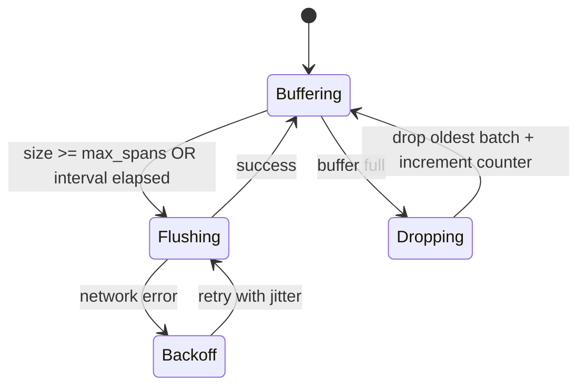

# Wire Protocol

## Goals

- Low overhead export from Ruby
- Easy to debug (HTTP)
- Path to OpenTelemetry interop
- Versioned and evolvable

## Dual-mode strategy

| Mode | When | Format |
|------|------|--------|
| **Native** (default MVP) | Gem → Agent | HTTP POST, MessagePack or JSON |
| **OTLP** | Interop / dual export | OTLP/HTTP protobuf or JSON |

MVP implements **Native v1** fully. OTLP ingest is Phase 2+.

## Transport

```text
POST /v1/traces
Host: agent
Authorization: Bearer <project_api_key>
Content-Type: application/msgpack   # or application/json
Content-Encoding: gzip              # optional
```

```text
POST /v1/metrics    # optional if metrics derived server-side from spans
POST /v1/deploys
GET  /healthz
```

Default agent listen: `127.0.0.1:4318` (avoid colliding with OTLP 4317/4318 carefully — document ports).

**Proposed ports**

| Port | Service |
|------|---------|
| `7421` | Agent ingest (native) |
| `7422` | Server UI + query API |
| `4318` | Optional OTLP/HTTP ingest (later) |

## Native batch envelope (v1)

```json
{
  "protocol_version": 1,
  "sdk": {
    "name": "railspan-ruby",
    "version": "0.1.0",
    "language": "ruby",
    "runtime": "ruby-3.3.0"
  },
  "resource": {
    "service.name": "my-app",
    "deployment.environment": "production",
    "host.name": "web.1",
    "process.pid": 1234,
    "railspan.framework": "rails",
    "railspan.framework_version": "8.0.0"
  },
  "spans": [ /* Span */ ]
}
```

### Span object

```json
{
  "trace_id": "4bf92f3577b34da6a3ce929d0e0e4736",
  "span_id": "00f067aa0ba902b7",
  "parent_span_id": null,
  "name": "http.server",
  "kind": "http.server",
  "resource": "UsersController#show",
  "start_time_unix_ns": 1710000000000000000,
  "end_time_unix_ns": 1710000000120000000,
  "status": "ok",
  "attributes": {
    "http.method": "GET",
    "http.route": "/users/:id",
    "http.status_code": 200
  },
  "events": []
}
```

### Status

- `ok`
- `error`

### Events (exceptions, log-ish markers)

```json
{
  "time_unix_ns": 1710000000110000000,
  "name": "exception",
  "attributes": {
    "exception.type": "ActiveRecord::RecordNotFound",
    "exception.message": "Couldn't find User",
    "exception.stacktrace": "..."
  }
}
```

## Flush behavior (gem)



| Parameter | Default |
|-----------|---------|
| `max_spans_per_batch` | 100–500 |
| `flush_interval` | 100–500 ms |
| `max_queue_spans` | 10_000 |
| `export_timeout` | 2–5 s |
| `fail_open` | true (never raise into app request) |

## Sampling decision headers (optional)

Agent may respond:

```json
{
  "ok": true,
  "accepted_spans": 120,
  "dropped_spans": 0,
  "advice": {
    "sample_rate": 0.05
  }
}
```

Gem may adapt client sample rate (Phase 2). MVP can ignore `advice`.

## Query API (server → UI)

Prefix: `/api/v1`

| Method | Path | Purpose |
|--------|------|---------|
| GET | `/projects` | List projects |
| POST | `/projects` | Create project (returns API key once) |
| GET | `/endpoints` | Aggregated endpoint metrics |
| GET | `/traces` | Search traces |
| GET | `/traces/:trace_id` | Trace detail + spans |
| GET | `/n-plus-one` | N+1 events |
| GET | `/deploys` | Deploy markers |
| POST | `/deploys` | Record deploy |
| GET | `/health` | Liveness |

### Example: endpoints

```http
GET /api/v1/endpoints?project_id=...&from=-24h&to=now&sort=p95&limit=50
Authorization: Bearer <ui_or_api_token>
```

Response sketch:

```json
{
  "endpoints": [
    {
      "resource": "UsersController#show",
      "method": "GET",
      "count": 15200,
      "error_rate": 0.012,
      "p50_ms": 18.2,
      "p95_ms": 120.4,
      "p99_ms": 340.1,
      "n_plus_one_count": 42
    }
  ]
}
```

## Auth

| Path | Auth |
|------|------|
| Ingest `/v1/*` | Project API key |
| Query `/api/v1/*` | Same key or UI session token |
| `/healthz` | None |

API keys stored hashed at rest (server).

## Versioning

- `protocol_version` integer in envelope  
- Breaking changes → increment + agent accepts N and N-1 for one release  
- Document in CHANGELOG  

## PII scrubbing (before wire or at agent)

Applied to attributes values matching:

- `password`, `token`, `secret`, `authorization`
- Email-like regexes in SQL raw  
- Long numeric tokens  

Prefer scrub in gem (never leave process) + second pass in agent.

## Error responses

| Code | Meaning |
|------|---------|
| 400 | Invalid payload |
| 401 | Bad API key |
| 413 | Batch too large |
| 429 | Rate limited / backpressure |
| 507 | Storage exhausted |
| 5xx | Retryable |

Gem treats 429/5xx as retryable with exponential backoff; 4xx (except 429) as drop + log once.
