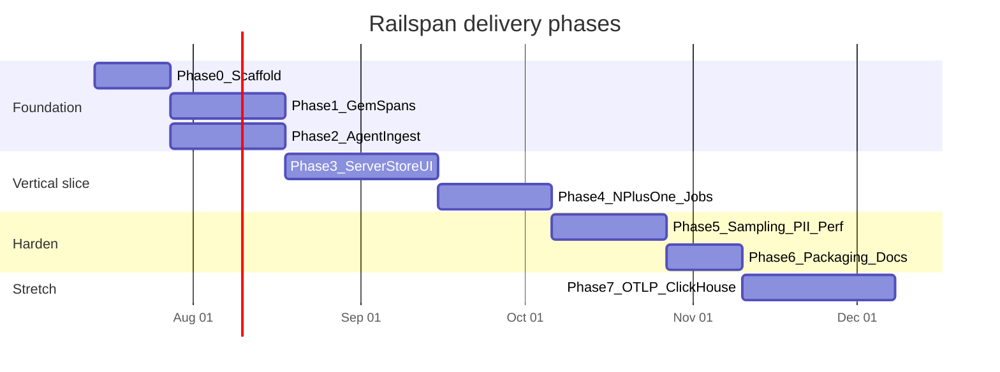

# Roadmap

## Timeline overview



Dates are indicative; adjust when work starts. Dependencies matter more than calendar.

## Phase 0 — Monorepo & foundations

**Goal:** Empty but buildable skeleton; CI green; docs linked.

- Cargo workspace (`agent`, `server`, `protocol`, `cli`)
- Ruby gem skeleton with Rails Railtie stub
- UI package stub
- Docker compose stub
- CI: `cargo test`, `bundle exec rspec` (or minitest), lint
- ADR process folder `docs/adrs/`

**Exit criteria**

- [ ] `cargo build` works  
- [ ] Gem installs in a dummy Rails app  
- [ ] README points to plan docs  

## Phase 1 — Ruby instrumentation (stdout / file first)

**Goal:** Correct span trees for a real request without agent.

- Rack root span  
- Controller, SQL, view subscribers  
- Context propagation (trace/span id in thread + fiber-aware as needed)  
- JSON lines exporter to stdout for debugging  
- Fixture Rails app under `examples/dummy_rails`

**Exit criteria**

- [ ] Single request produces nested span JSON  
- [ ] SQL spans present for ActiveRecord  
- [ ] Unit tests for normalizer + context  

## Phase 2 — Rust agent ingest

**Goal:** Agent accepts batches; samples; logs/writes locally.

- HTTP ingest `/v1/traces`  
- Msgpack/JSON decode  
- Bounded queue + worker  
- Basic sampling (errors, slow, probabilistic)  
- SQL normalize + PII scrub  
- Metrics aggregation in memory  
- Health endpoint  

**Exit criteria**

- [ ] Dummy app flushes to agent  
- [ ] Agent survives flood without OOM  
- [ ] Drop counters visible  

## Phase 3 — Server, store, minimal UI

**Goal:** End-to-end vertical slice.

- Persist traces/spans/metrics (SQLite)  
- Query API: endpoints + trace detail  
- UI: endpoint table + waterfall  
- `railspan serve` runs agent+server+UI  
- Project + API key create flow  

**Exit criteria**

- [ ] New user path works in &lt; 15 min with docs  
- [ ] Waterfall matches known fixture request  
- [ ] Top endpoints sort by p95  

## Phase 4 — Rails-depth features

**Goal:** Differentiation.

- N+1 detector + UI badge  
- ActiveJob + Sidekiq instrumentation  
- Cache + outbound HTTP spans  
- Deploy markers API + chart overlay  
- Error spans / exception events  

**Exit criteria**

- [ ] Seeded N+1 always flagged  
- [ ] Job appears with duration and queue  
- [ ] Deploy line visible on latency chart  

## Phase 5 — Production hardening

**Goal:** Safe to leave on in staging/prod.

- Overhead benchmarks in CI  
- Adaptive sampling advice  
- Retention job / TTL  
- Auth for UI  
- Cardinality guards  
- Structured logging  
- Runbooks  

**Exit criteria**

- [ ] Overhead budget documented and measured  
- [ ] 24h soak on example app  
- [ ] No unbounded disk growth  

## Phase 6 — Packaging & launch quality

**Goal:** Others can install.

- Release binaries (macOS/Linux)  
- Docker images  
- Hex/RubyGems publish pipeline (private first OK)  
- Tutorial + screenshot docs  
- Example Heroku/Render/Fly configs  

**Exit criteria**

- [ ] `docker compose up` demo works cold  
- [ ] Gem versioned release  
- [ ] Public README polished  

## Phase 7 — Scale & interop (stretch)

- OTLP/HTTP ingest  
- ClickHouse backend option  
- Multi-node agent → server  
- Optional OTLP export from agent  
- Continuous profiling spike (Vernier bridge or sampling agent)  

## Priority stack (if time-constrained)

```text
P0  Vertical slice: gem → agent → store → endpoints UI → waterfall
P1  N+1 + Sidekiq
P2  Sampling, PII, retention, overhead
P3  Packaging
P4  OTLP / ClickHouse / profiling
```

## Dogfooding plan

1. Instrument `examples/dummy_rails` always  
2. After Phase 3, run against one personal/internal Rails app  
3. Track issues as backlog bugs, not silent debt  

## Definition of Done (every story)

- Tests (unit and/or integration)  
- Docs updated if user-facing  
- No unbounded allocations in hot paths without comment  
- Linked to epic  
